# SDLC Methodologies

A concise, easy-to-follow guide to the **Software Development Life Cycle (SDLC)** and its core **methodologies**, explained with short, plain-language descriptions, use cases, pros and cons.

## Table of Contents

| No. | Topic                                                          |
| --- | -------------------------------------------------------------- |
| 1   | [What is SDLC?](#1-what-is-sdlc)                               |
| 2   | [What are the phases of SDLC?](#2-what-are-the-phases-of-sdlc) |
| 3   | [Top SDLC Methodologies?](#3-top-sdlc-methodologies)           |
| 4   | [Waterfall Model](#4-waterfall-model)                          |
| 5   | [V-Shaped Model](#5-v-shaped-model)                            |
| 6   | [Incremental Model](#6-incremental-model)                      |
| 7   | [Iterative Model](#7-iterative-model)                          |
| 8   | [Prototype Model](#8-prototype-model)                          |
| 9   | [RAD Model](#9-rad-model)                                      |
| 10  | [Spiral Model](#10-spiral-model)                               |
| 11  | [Agile Model](#11-agile-model)                                 |
| 12  | [References](#12-references)                                   |

## 1. What is SDLC?

> **The Software Development Life Cycle (SDLC) refers to a methodology with clearly defined processes for creating high-quality software.**

**[⬆ Back to Top](#table-of-contents)**

## 2. What are the phases of SDLC?

The SDLC methodology consists of the following phases of software development:

<p align="center">
    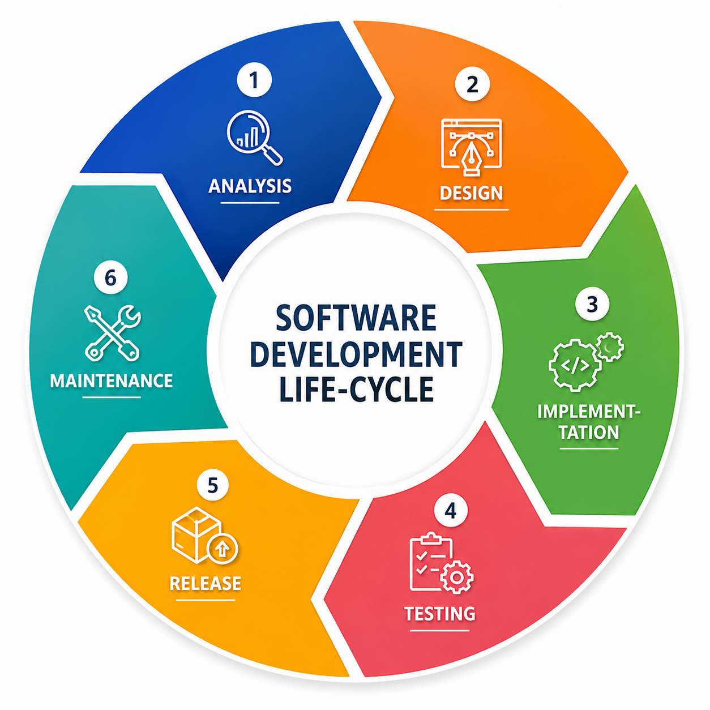
</p>

**Phase 1 – Analysis/Planning**

The very first phase of the SDLC is known as the planning stage. It is the most important phase of the entire SDLC from the perspective of project managers and stakeholders.
It is performed by the senior members of the team with inputs from the customer, the sales department, market surveys and domain experts in the industry.

<details>
<summary><b>Sub Phases of Analysis/Planning </b></summary>

The Planning phase can be divided into 3 sub-phases:

**Sub Phase 1 – Requirement Analysis**

- How the software will be used?
- What data will serve as the input of the software?
- What data will be the output given by the software?
- Who is going to use the software?

**Sub Phase 2 – Feasibility Study**

In this phase, evaluate the requirements for feasibility. The goal is to quantify the opportunities and risk of addressing the agreed requirements with the variety of resources and strategies available to the organization. The feasibility study evaluates the following key aspects, among others:

- Economic: Is it financially viable to invest in the project based on the available resources?
- Legal: What is the scope of regulations and the organization's capacity to guarantee compliance?
- Operational: Can we satisfy the requirements within scope definition according to the proposed operational framework and workflows?
- Technical: What is the availability of technology and HR resources to support the SDLC process?
- Schedule: Can we finish the project in time?
- Executive decision makers should answer and document these questions and study them carefully—before proceeding with the software design and implementation process.

**Sub Phase 3 – Defining Requirements**

Once the requirement analysis and feasibility study is done the next step is to clearly define and document the product requirements and get them approved from the customer or the market analysts. This is done through an SRS (Software Requirements Specification) document which consists of all the product requirements to be designed and developed during the project life cycle.

</details>

**Phase 2 – Design**

This phase defines the specifications, features and operations that will satisfy the functional requirements of the proposed system. End users determine their specific business information needs, along with the essential components (hardware and/or software), structure (networking capabilities), processing and procedures needed to accomplish the objectives.

The SRS is the reference for product architects to design the best architecture for the product. Based on the SRS, usually more than one design approach is proposed and documented in a DDS (Design Document Specification).

The DDS is reviewed by all the important stakeholders. Based on parameters such as risk assessment, product robustness, design modularity, budget and time constraints, the best design approach is selected.

The chosen design clearly defines all the architectural modules of the product along with their communication and data flow representation with external and third-party modules (if any). The internal design of every module should be defined in detail in the DDS.

**Phase 3 – Development/Implementation**

In this phase the actual development starts and the product is built. The code is generated and the database is designed as per the DDS. If the design is detailed and organized, code generation can be done without much hassle.

Developers must follow the coding guidelines defined by their organization, and tools such as compilers, interpreters and debuggers are used to generate the code. High-level programming languages such as C, C++, Pascal, Java and PHP are used for coding, and structured and non-structured databases such as Oracle, MSSQL, MySQL and MongoDB are used for storing data.

**Phase 4 – Testing/Quality Assurance**

In this phase, systems integration and system testing are normally carried out by a Quality Assurance (QA) professional to determine if the proposed design meets the initial set of business goals. Testing may be repeated to check for errors, bugs and interoperability, and continues until the end user finds it acceptable.

Various types of functional testing — acceptance, integration, system and unit testing — as well as non-functional testing, are carried out.

**Phase 5 – Deployment/Release**

This phase is carried out right after the successful testing of the software product. It delivers the software to the end-user or installs it onto the customer's system(s). Once the product is delivered, beta testing begins and all bugs and enhancements are reported to the development team. Once the changes are complete, the final deployment takes place.

**Phase 6 – Maintenance**

The final phase involves maintenance and regular required updates. End users can fine-tune the system to boost performance, add new capabilities or meet additional user requirements.

**[⬆ Back to Top](#table-of-contents)**

## 3. Top SDLC Methodologies?

```
SDLC Methodologies
│
├── Waterfall
├── Prototyping
├── Spiral
├── V-Model
├── RAD (Rapid Application Development)
├── Iterative and Incremental
│
├── Agile
│   ├── Scrum
│   ├── Kanban
│   ├── Lean
│   ├── Crystal
│   ├── Extreme Programming (XP)
│   ├── Feature-Driven Development (FDD)
│   └── Dynamic Systems Development Method (DSDM)
│
└── DevOps
```

**[⬆ Back to Top](#table-of-contents)**

## 4. Waterfall Model

> **Waterfall is a sequential and linear flow for developing a software application.**

The project moves through a series of finite stages, and each stage must be fully completed before the next one begins. The idea is simple: finish one phase completely, then move on to the next.

<p align="center">
    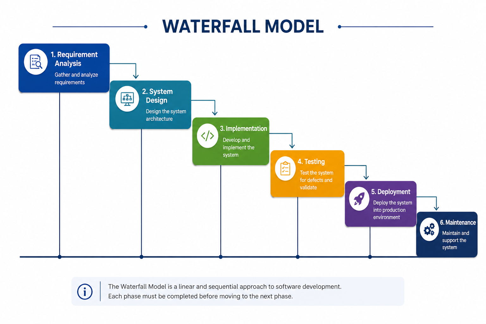
</p>

**Use cases for the Waterfall model:**

- This model is used only when the requirements are very well known, clear and fixed
- There are no ambiguous or undefined requirements
- The requirements are precisely documented
- The technology stack is predefined which makes it not dynamic
- The project is small or mid-sized

**Pros:**

- Each stage is clearly defined
- Process and results are well documented
- Simple and easy to understand and use
- Easy to manage due to the rigidity of the model

**Cons:**

- Cannot accommodate changing requirements
- Requirement changes at the later stages would lead to higher costs as the changes would be required in all the phases
- No working software module is produced until late in the life cycle
- The progress of the stage is hard to measure while it is still in the development
- Not suitable for the projects where requirements are at a moderate to high risk of changing

**[⬆ Back to Top](#table-of-contents)**

## 5. V-Shaped Model

> **V-shaped SDLC model is an expansion of classic waterfall model where each development activity is associated with a testing phase. It is also known as Verification and Validation model.**

<p align="center">
    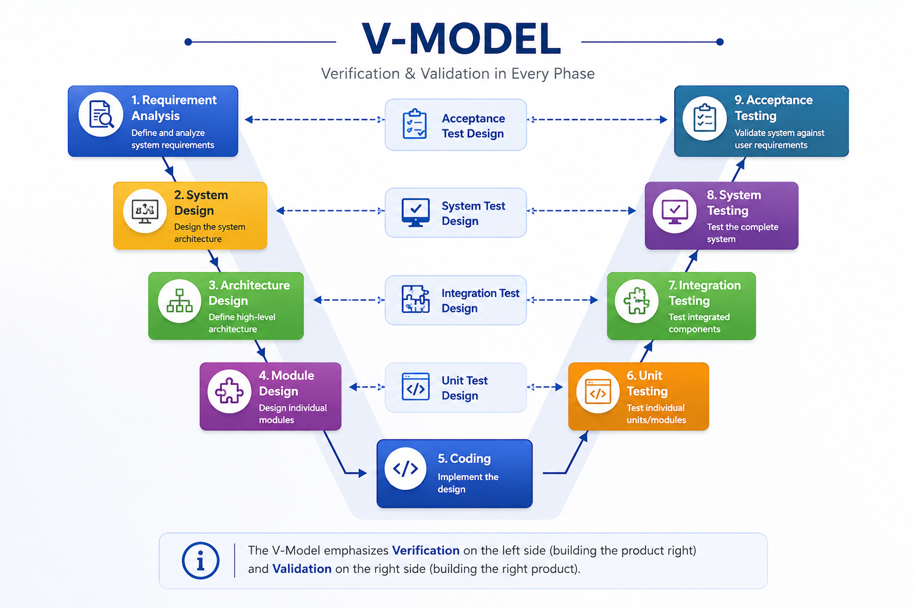
</p>

The V-Model contains Verification phases on one side and the Validation phases on the other side. Verification and Validation process is joined by the coding phase in V-shape. Thus it is known as V-Model.

**Verification:** A static analysis method (review) done without executing code. It evaluates the development process to find whether the specified requirements are met.

**Validation:** A dynamic analysis method (functional and non-functional) done by executing code. It evaluates the completed software to determine whether it meets the customer's expectations and requirements.

<details>
<summary><b>V-Model - Verification Phases </b></summary>

1. **Business requirement analysis:** This is the first step where product requirements understood from the customer's side. This phase contains detailed communication to understand the customer's expectations and exact requirements.

2. **System Design:** In this stage system engineers analyze and interpret the business of the proposed system by studying the user requirements document.

3. **Architecture Design:** The baseline for selecting the architecture is that it should cover everything, which typically consists of the list of modules, brief functionality of each module, their interface relationships, dependencies, database tables, architecture diagrams, technology details, etc. The integration testing model is carried out in a particular phase.

4. **Module Design:** In the module design phase, the system breaks down into small modules. The detailed design of the modules is specified, which is known as Low-Level Design.

5. **Coding Phase:** After designing, the coding phase is started. Based on the requirements, a suitable programming language is decided. There are some guidelines and standards for coding. Before checking in the repository, the final build is optimized for better performance, and the code goes through many code reviews to check the performance.

</details>
<details>
<summary><b>V-Model - Validation Phases: </b></summary>

1. **Unit Testing:** Unit Test Plans are developed during module design phase. These Unit Test Plans are executed to eliminate bugs at code or unit level.

2. **Integration testing:** After completion of unit testing Integration testing is performed. In integration testing, the modules are integrated and the system is tested. Integration testing is performed in the Architecture design phase. This test verifies the communication of modules among themselves.

3. **System Testing:** System testing tests the complete application with its functionality, interdependency, and communication. It tests the functional and non-functional requirements of the developed application.

4. **User Acceptance Testing (UAT):** UAT is performed in a user environment that resembles the production environment. UAT verifies that the delivered system meets user's requirement and system is ready for use in real world.

</details>

**Use cases for the V-shaped model:**

- Same as the Waterfall model — requirements are well known, clear, fixed and precisely documented
- For projects where accurate product testing is required

**Pros:**

- Each stage is clearly defined
- Process and results are well documented
- Simple and easy to understand and use
- Easy to manage due to the rigidity of the model
- Proactive defect tracking – that is defects are found at an early stage
- Testing and verification take place in the early stages which leads to developing an error-free and good quality product
- Higher success chances
- Covers all functional areas
- It enables project management to track progress accurately

**Cons:**

- Cannot accommodate changing requirements. Even more rigid and less flexible than the Waterfall model
- Requirement changes at the later stages would lead to higher costs as the changes would be required in all the phases
- Requirement and test documents need to be updated if any changes have to be made amid the software development
- No working software module is produced until late in the life cycle
- The progress of the stage is hard to measure while it is still in the development
- Not suitable for the projects where requirements are at a moderate to high risk of changing
- Not a good model for large or complex and object-oriented projects

<details>
<summary><b>Similarities between Waterfall and V-model :</b></summary>

<p align="center">
    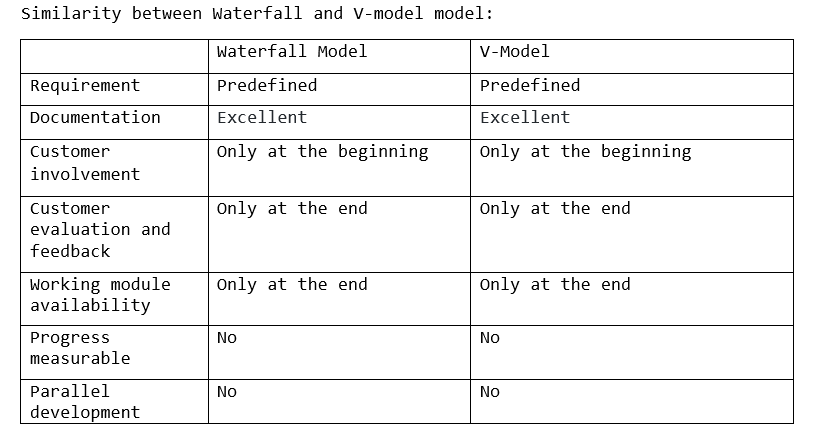
</p>
</details>

<details>
<summary><b>Differences between Waterfall and V-model :</b></summary>

<p align="center">
    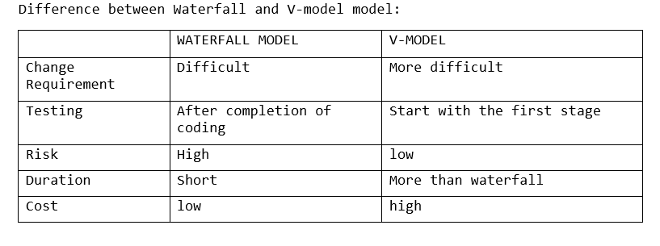
</p>
</details>

**[⬆ Back to Top](#table-of-contents)**

## 6. Incremental Model

> **The iterative and incremental methodology is designed to overcome any fault or shortcoming of the Waterfall methodology.**

The whole requirement is divided into various builds. Each build goes through the requirements, design, implementation and testing phases, and each subsequent release adds function to the previous one. The process continues until the complete system is ready.

<p align="center">
    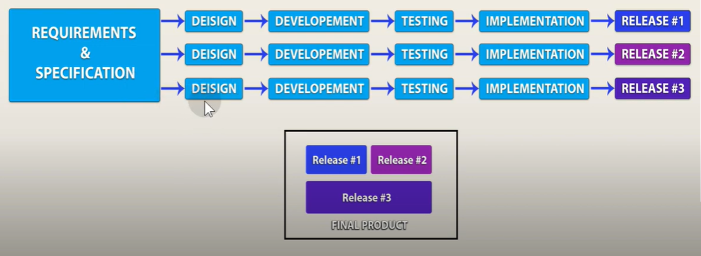
</p>

**Use cases for the Incremental model:**

- This model can be used when the requirements of the complete system are clearly defined and understood
- There is a need to get a functional module of the product to the market early

**Pros:**

- It supports changing requirements
- Less costly to change the scope/requirements
- Results are obtained early and periodically
- With every increment, operational product is delivered
- It delivers business value early in the development lifecycle
- Progress can be measured
- Parallel development can be planned
- Testing and debugging during smaller iteration is easy
- Customer evaluation and feedback is available in each increment which leads to better solutions
- Issues, challenges and risks identified from each increment can be resolved to the next increment

**Cons:**

- Needs a clear and complete definition of the whole system before it can be broken down and built incrementally
- Each iteration is rigid
- Although cost of change is lesser, it is not very suitable for changing requirements
- More resources may be required
- Highly skilled resources are required for risk analysis
- More management attention is required

<details>
<summary><b>Similarities between Waterfall and Incremental model: </b></summary>

<p align="center">
    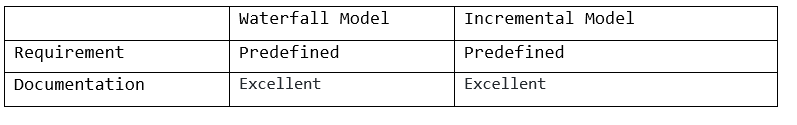
</p>
</details>

<details>
<summary><b>Differences between Waterfall and Incremental model: </b></summary>

<p align="center">
    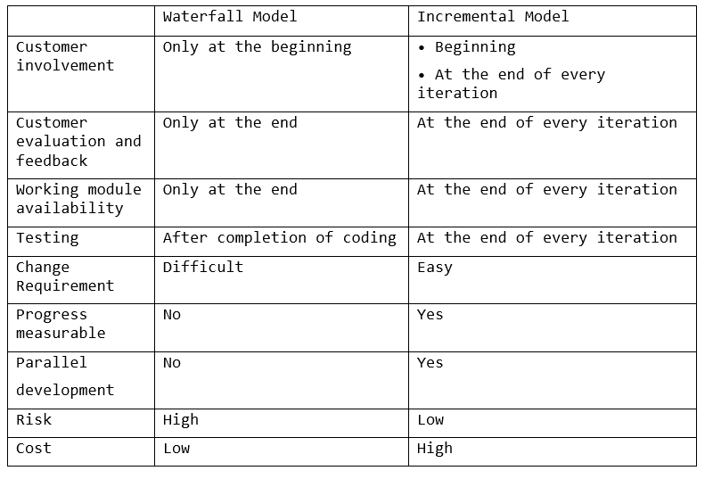
</p>
</details>

**[⬆ Back to Top](#table-of-contents)**

## 7. Iterative Model

> **The iterative model is an evolutionary approach in which the software is developed and delivered in small pieces, called iterations.**

Each iteration goes through its own planning, design, coding and testing phases, and produces a working version of the software. This version is then refined in the next iteration based on feedback, until the complete system meets the requirements.

<p align="center">
    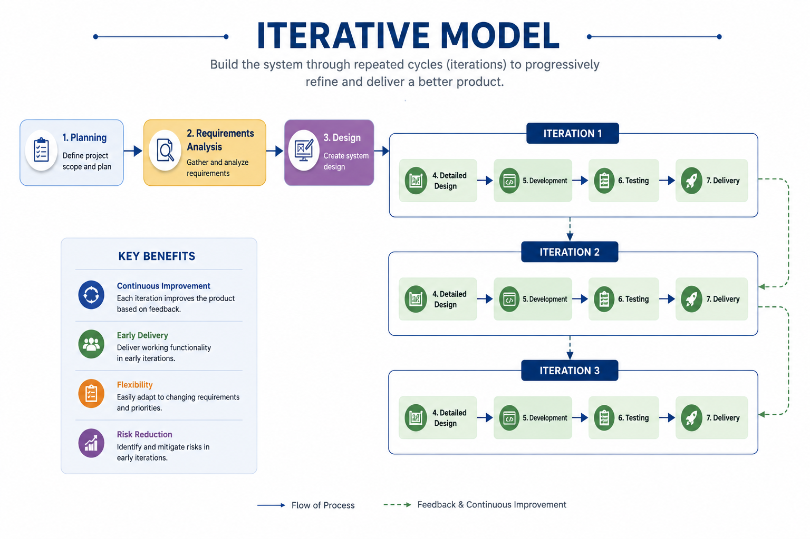
</p>

**Use cases for the Iterative model:**

- The requirements are not fully known at the start and are expected to evolve
- A working version of the product is needed early to gather customer feedback

**Pros:**

- Supports changing requirements
- A working version of the product is delivered with every iteration
- Customer feedback from each iteration leads to better solutions
- Risks are identified early and resolved in the next iteration

**Cons:**

- Requires active customer involvement throughout the project
- Scope can keep expanding, delaying the final product
- More resources and management attention may be required

**[⬆ Back to Top](#table-of-contents)**

## 8. Prototype Model

- The Prototype model is an evolutionary software process model that is a combination of the Iterative and waterfall model
- Prototype is built, tested, and reworked using iterative methodology until the model is accepted by the customer.
- Customer feedback and the refined requirement is used to modify the prototype and is again presented to the customer for evaluation. Once the customer approves the prototype, it is used as a requirement for building the actual software. The actual software is built using the Waterfall model approach.
- Software prototyping is used in certain cases and the decision should be taken very carefully so that the efforts spent in building the prototype add considerable value to the final software developed.

<p align="center">
    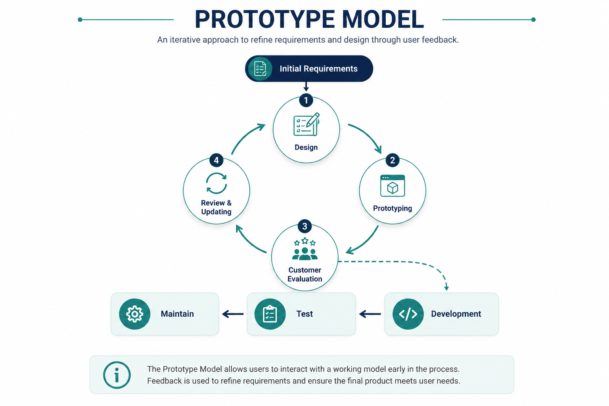
</p>

**Use cases for the Prototype model:**

- It is used when user is not sure of the system, in other words requirements are incomplete

**Pros:**

- Prototyping methodology is quite adaptive as any updates or new requirements are accommodated
- Prototypes can be changed and even discarded
- Increased user involvement in the product even before its implementation
- Allows the client to compare if the software code matches the software specification
- Helps to gain a better understanding of the customer's needs
- It mitigates or eliminates the risks before the actual product is developed
- Quicker client feedback is available leading to better solutions
- Missing functionality identified in the evaluation phase and implemented in the refined prototype
- It also identifies the complex or difficult functions
- Encourages innovation and flexible designing
- No need for specialized experts to build the model

**Cons:**

- Prototyping is a time-consuming process
- It can be comparatively costly as more time and resources are required for prototyping
- The cost of developing a prototype is a total waste as the prototype is ultimately thrown away
- The effort invested in building prototypes may be too much if it is not monitored properly
- Poor documentation because the requirements of the customers are insufficient
- Risk of insufficient requirement analysis owing to too much dependency on the prototype.
- Prototyping may encourage excessive change requests
- There may be far too many variations in software requirements when each time the prototype is evaluated by the customer
- It is very difficult for software developers to accommodate all the changes demanded by the clients.
- Users may get confused in the prototypes and actual systems
- After seeing an early prototype model, the customers may think that the actual product will be delivered to them soon
- Developers who want to build prototypes quickly may end up building sub-standard development solutions
- Developers may try to reuse the existing prototypes to build the actual system, even when it is not technically feasible

<details>
<summary><b>Similarities between Waterfall and Prototype model: </b></summary>

<p align="center">
    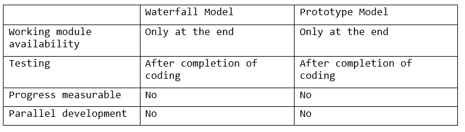
</p>
</details>

<details>
<summary><b>Differences between Waterfall and Prototype model: </b></summary>

<p align="center">
    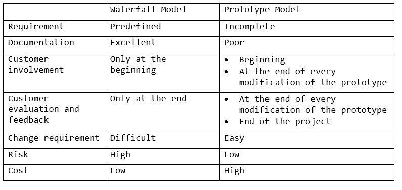
</p>
</details>

**[⬆ Back to Top](#table-of-contents)**

## 9. RAD Model

- The RAD model is a concurrent software process model generally based on the prototype (Iterative and waterfall) model.
- The entire project is divided into small modules; each module is developed in parallel by a different party, and then all modules are combined into the final project.
- Each module is developed using the Prototyping (Iterative and waterfall) approach.
- This model is used to complete software product development in a very short time.
- Use it when your project can be divided into many parts or modules.

<p align="center">
    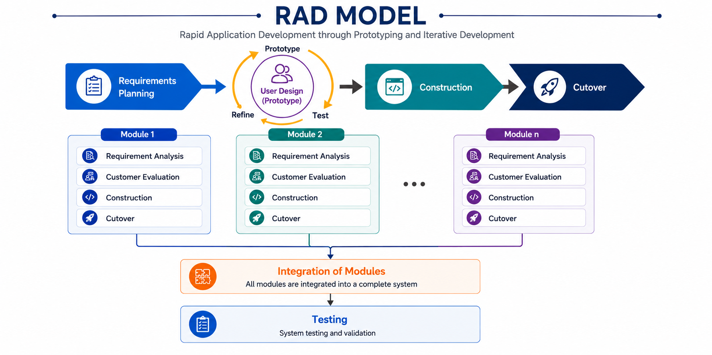
</p>

Although RAD has changed over the years, following four basic phases provide some continuity over the years.

1. **Requirement Analysis:** There are various approaches used in requirement planning like brainstorming, task analysis, form analysis, user scenario, etc. This phase consists of planning or designing of each module which contains data, methods and other resources.

2. **Customer Evaluation:** In this phase, developers evaluate customer satisfaction by delivering the prototype and taking their reviews. If the customer is satisfied then the developer starts implementation.

3. **Construction:** The prototype is refined and all the modifications, corrections and improvements are done in this phase. This phase helps us to convert the process and modules into the final working product.

4. **Cut Over:** This is the last stage of the RAD model. In this phase, all the independent modules are evaluated separately. The tools and sub-parts of the product make the testing of the product very easy.

**Use cases for the RAD model:**

- This model works only when the requirements are clearly specified
- RAD should be used only when a system can be modularized to be delivered in an incremental manner.
- When there's a necessity to make a system which can be modularized within a period of 2-3 months.
- When the requirements are well-known.
- When the technical risk is limited.
- It should be used if there is a high availability of designers for modeling.
- It should be used only if the budget permits the use of automated code generating tools.
- RAD SDLC model should be chosen only if domain experts are available with relevant business knowledge.

**Pros:**

- Changing requirements can be accommodated at any time
- More flexibility and adaptability to acquire new requirements
- Development time is drastically reduced – the model completes the project in a short period of time
- Reviews are quick and customer feedback is encouraged and prioritized
- Reduced cost because very few developers are needed, with more productivity from fewer people
- Iteration time can be short with the use of powerful RAD tools
- The progress and development of the project can be checked at various stages
- Integration from the very beginning solves a lot of integration issues
- Prototype is delivered to the customer so the customer is satisfied
- Reusability of the components is increased, which speeds up development and reduces the time needed to develop a product
- The modularized way of crafting each function within the system makes the development task easier
- Reduces the risk and required effort on the part of the software developer
- This methodology encourages customer feedback which always provides improvement scope for any software development project

**Cons:**

- Not all applications are compatible with RAD
- Only systems which can be modularized can be built using this methodology
- High dependency on modeling skills; requires highly skilled developers/designers
- Needs strong team collaboration and technically strong team members for identifying business requirements
- Not suitable when the technical risk is high
- Requires user involvement and customer feedback throughout the life cycle of the product
- More complex to manage when compared to other models
- A proper time-frame should be maintained for both end customers and developers for completing the system
- A slight complexity in modularizing in the RAD model can lead to failure of the entire project
- Inapplicable to small-budget projects as the cost of modeling and automated code generation is very high

**[⬆ Back to Top](#table-of-contents)**

## 10. Spiral Model

- The spiral model is an evolutionary software process model combining the Iterative and Prototyping models with the systematic, controlled aspects of the Waterfall model.
- It allows incremental releases of the product or incremental refinement through each iteration around the spiral.
- It places very high emphasis on risk analysis during each iteration

<p align="center">
    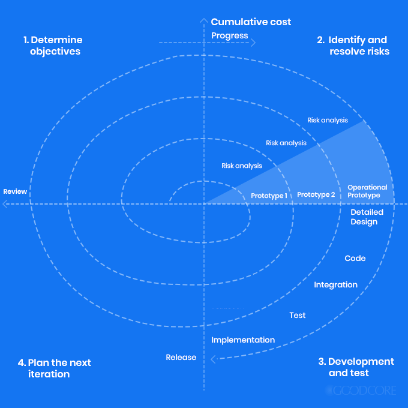
</p>

Each loop of the spiral is called a Phase of the software development process. Each phase of Spiral Model is divided into four quadrants as shown in the above figure. The functions of these four quadrants are discussed below-

1. **Determining objectives, alternatives and constraints:** Requirements are gathered from the customers and the objectives are identified, constraints are evaluated and different alternative solutions for the development are proposed in this quadrant.
2. **Evaluating alternatives, identifying and resolving risks:** During the second quadrant all the possible solutions are evaluated to select the best possible solution. Then the risks associated with that solution is identified and the risks are resolved using the best possible strategy. At the end of this quadrant, Prototype is built for the best possible solution.
3. **Develop and verify next level project:** During the third quadrant, the identified features are developed and verified through testing. At the end of the third quadrant, the next version of the software is available.
4. **Review and plan for the next Phase:** In the fourth quadrant, the Customers evaluate the so far developed version of the software. In the end, planning for the next phase is started.

**Use cases for the Spiral model:**

- Customer isn't sure about the requirements
- Requirements are unclear or complicated and require continuous clarification
- Frequent releases of modules are required
- When creation of a prototype is applicable
- Customer evaluation and feedback is required in each increment to develop better solutions
- Significant changes are expected in the product during the development cycle
- Projects in which continuous risk evaluation is needed
- It is suitable for large and complex projects

**Pros:**

- Requirement changes can be easily adopted and incorporated at the later stage of the development
- Requirements can be captured more accurately by emphasizing customer feedback of each phase
- Any enhancement or change in the functionality can be done in the next iteration
- Customer evaluation and feedback is available in each iteration which leads to better solutions
- Handling risk analysis in every phase improves security and mitigates the chances of attacks and breakages
- Allows extensive use of prototypes
- Users see the system early
- More and more features are added in a systematic way

**Cons:**

- It is complex to understand, manage and implement
- Requires high risk-analysis expertise
- Demands risk management expertise
- Since the number of iterations is unknown, the time required to complete the project remains a mystery
- The project takes a significantly long time to develop, increasing the overall expense of the project
- End of the project may not be known early
- High risk for falling behind schedule or going over budget
- Large number of intermediate stages requires excessive documentation

**[⬆ Back to Top](#table-of-contents)**

## 11. Agile Model

- Agile is an iterative and incremental software development approach that delivers working software in small, frequent releases called sprints or iterations.
- It emphasizes collaboration, customer feedback, and adaptability to change rather than following a rigid, pre-planned process.
- Common Agile frameworks include Scrum, Kanban, and Extreme Programming (XP).

<p align="center">
    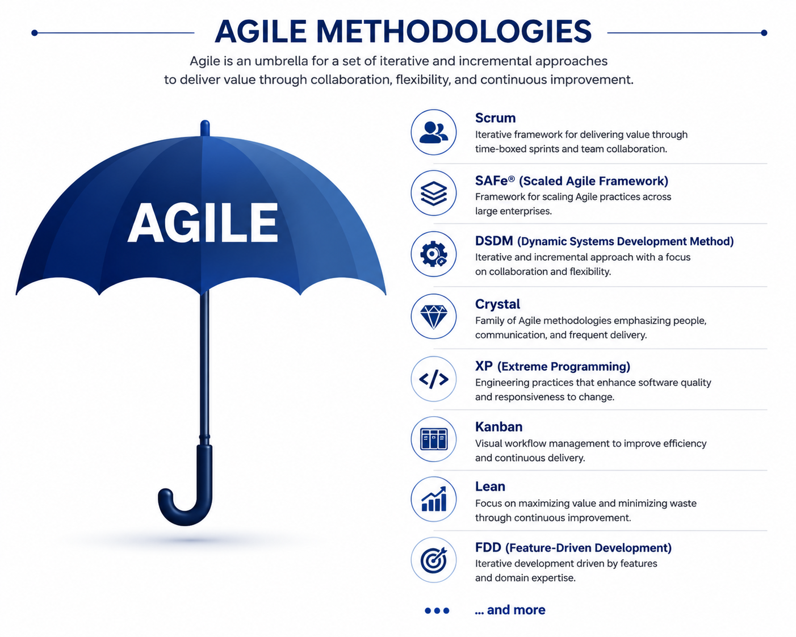
</p>

**Use cases for the Agile model:**

- When the requirements are expected to change frequently
- When the customer wants to see working software early and often
- When continuous feedback and collaboration between the team and stakeholders is required
- For small to medium sized projects where cross-functional teams are available

**Pros:**

- Adapts quickly to changing requirements
- Delivers working software early and frequently
- Improves customer satisfaction through continuous feedback
- Reduces risk through regular testing and reviews
- Encourages close collaboration between developers and stakeholders
- Provides transparency of progress through regular demos and stand-ups

**Cons:**

- Less emphasis on detailed documentation
- Requires active customer involvement throughout the project
- Difficult to estimate total cost and timeline up front
- Can be hard to manage for large, complex projects
- Depends heavily on the experience and discipline of the team

**[⬆ Back to Top](#table-of-contents)**

## 12. References

I have followed many articles, but among them the following were really helpful. They helped me a lot and also encouraged me to write this article based on my understanding.

- [tutorialspoint](https://www.tutorialspoint.com/sdlc/index.htm)
- [tatvasoft](https://www.tatvasoft.com/blog/top-12-software-development-methodologies-and-its-advantages-disadvantages/)
- [scnsoft](https://www.scnsoft.com/blog/software-development-models)
- [cs.odu.edu](https://www.cs.odu.edu/~zeil/cs350/f15/Public/processModels/)
- [visual-paradigm](https://www.visual-paradigm.com/guide/software-development-process/what-is-a-software-process-model/)
- [javatpoint](https://www.javatpoint.com/software-engineering-sdlc-models)
- [w3schools.in](https://www.w3schools.in/sdlc-tutorial/software-development-life-cycle-sdlc/)
- [prepinsta](https://prepinsta.com/software-engineering/software-development-life-cycle-models/)
- [techuz](https://www.techuz.com/blog/top-12-sdlc-methodologies-with-pros-and-cons/)
- [softwaretestinghelp](https://www.softwaretestinghelp.com/software-development-life-cycle-sdlc/)
- [cybercraftinc](https://cybercraftinc.com/blog/top-software-development-models-their-pros-cons)
- [existek](https://existek.com/blog/sdlc-models/)
- [guru99](https://www.guru99.com/compare-waterfall-vs-incremental-vs-spiral-vs-rad.html)
- [agility](https://agility.im/frequent-agile-question/difference-incremental-iterative-development/)
- [quora](https://www.quora.com/What-is-the-difference-between-agile-incremental-and-iterative)
- [availagility](https://availagility.co.uk/2009/12/22/fidelity-the-lost-dimension-of-the-iron-triangle/)
- [wrike](https://www.wrike.com/project-management-guide/faq/what-are-the-different-types-of-agile-methodologies/)
- [blueprintsys](https://www.blueprintsys.com/agile-development-101/agile-methodologies)
- [melsatar](https://melsatar.blog/2012/03/21/choosing-the-right-software-development-life-cycle-model/?fbclid=IwAR1mpCDGUxD0CuhdSWtgtHsUEXQWMtPi4aWCdG03P1p-bYoXXY9M_geNZl4)
- [softwaretestingclass](https://www.softwaretestingclass.com/what-is-the-difference-between-scrum-kanban-and-xp/)

**[⬆ Back to Top](#table-of-contents)**

## Author

**Md. Saiful Islam**
_A Software Engineer interested in Software Design & Architecture_

**GitHub:** [@saifaustcse](https://github.com/saifaustcse)
**LinkedIn:** [Md. Saiful Islam](https://www.linkedin.com/in/saif-aust-cse/)

If you find this guide useful, please give :star:. Your support is appreciated!
